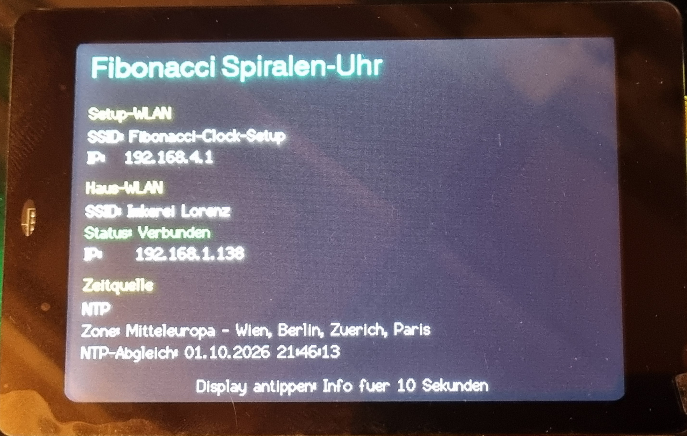
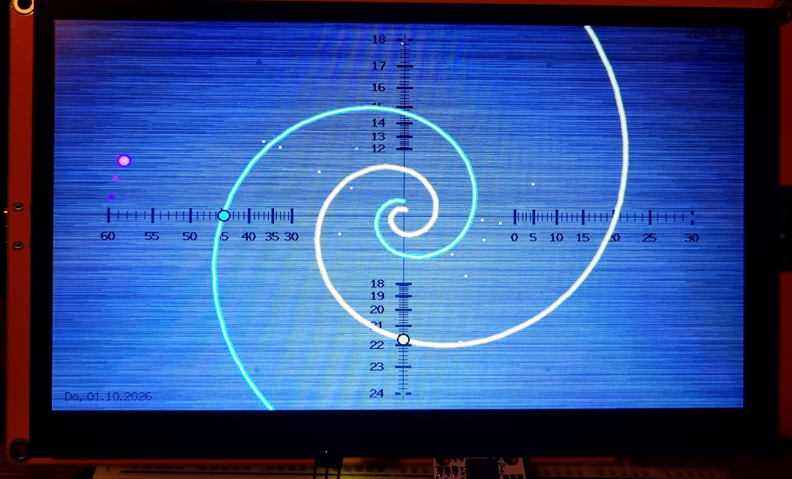
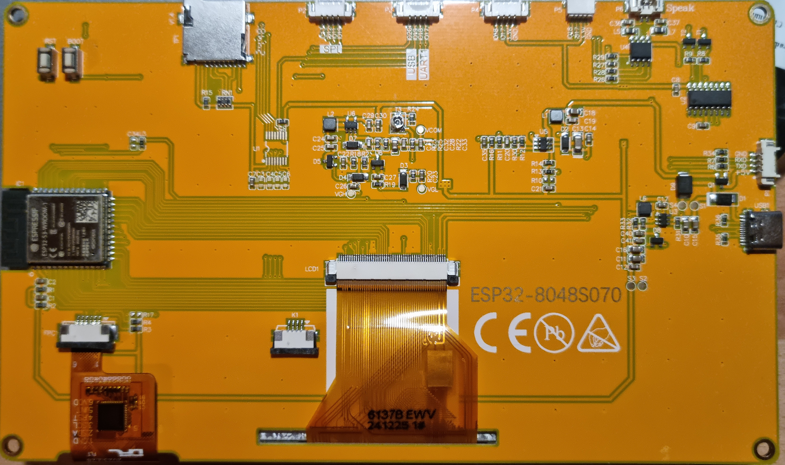

# Fibonacci-Spiralen-Uhr -- Multi-Board

Grafische Fibonacci-Uhr für **WT32-SC01** und **Sunton ESP32-8048S070**
mit einem gemeinsamen Programmstand.

Die Uhr zeigt Stunden und Minuten mit logarithmischen
Fibonacci-Spiralen. Dazu kommen feste Skalen, eine Sekundenellipse mit
Leuchtpunkt sowie optional eine digitale Datums- und Zeitanzeige.
Darstellung, WLAN, NTP und Zeitzone werden über eine Weboberfläche
konfiguriert.

## Bilder

### WT32



### Sunton ESP32 S3 7"





## Unterstützte und getestete Hardware

### WT32-SC01

- ESP32-WROVER-B
- 3,5"-ST7796-Display, 480 × 320
- TFT_eSPI über SPI
- PSRAM
- Touchcontroller auf I²C-Adresse `0x38`
- SDA GPIO18 / SCL GPIO19
- optionale DS3231-RTC
- Renderintervall 30 ms
- eigener, für das WT32 abgestimmter Neon-Effekt

Bei der getesteten WT32-SC01 Extension-Platine Version 1.2 ist der
RTC-Bestückungsplatz U10 nicht bestückt. Beim Test wurde am I²C-Bus nur
der Touchcontroller auf `0x38` gefunden. Ohne externe RTC ist NTP die
normale Zeitquelle; alternativ kann die Uhrzeit vom Smartphone
übernommen werden.

### Sunton ESP32-8048S070

- ESP32-S3-WROOM, N16R8
- 7"-RGB-Display, 800 × 480
- LovyanGFX
- 8 MB PSRAM
- GT911-Touch
- Touch-I²C: SDA GPIO19 / SCL GPIO20
- GT911-Adresse `0x5D`
- Touch-Reset GPIO38
- Backlight GPIO2
- NTP / Software-Uhr
- Renderintervall 200 ms
- schmaler Neon-Effekt ohne dunkle Außenkontur

Display, RGB-Farben, PSRAM und GT911-Touch wurden auf der vorhandenen
Hardware getestet. Beim Sunton kann unmittelbar nach einem Neustart für
ungefähr 15--20 Sekunden ein sichtbares Flackern auftreten; anschließend
läuft die Anzeige im Test vollständig ruhig. Da dies den normalen
Betrieb nicht beeinträchtigt, wurde die stabile RGB-Konfiguration nicht
weiter verändert.

## Ein Projekt für beide Boards

Im Quelltext muss beim Hardwarewechsel nichts geändert werden. In
PlatformIO wird nur das gewünschte Environment gewählt:

- `wt32-sc01`
- `sunton-8048s070`

`BoardConfig.h` kapselt die hardwareabhängigen Unterschiede wie
Displaytyp, Spritetyp, Touch-/I²C-Konfiguration, Backlight, Fontzugriff
und Renderintervall.

Die gemeinsame Programmlogik enthält Fibonacci-Geometrie, automatische
Display-Skalierung, Skalen, Sekundenellipse, Datum/Uhrzeit,
Web-Konfiguration, Preferences, AP+STA, NTP, Zeitzonen, Touch-Infoseite,
Hintergründe, Partikel und Effekte.

## Projektstruktur

``` text
fibonacci-uhr/
├── .gitignore
├── README.md
├── LICENSE.md
├── platformio.ini
├── include/
│ ├── BoardConfig.h
│ └── boards/
│   └── LGFX_Sunton_8048S070.h
└── src/
  └── main.cpp
```

Das PlatformIO-Verzeichnis `.pio/` wird nicht in Git gespeichert.

## PlatformIO und Display

Beim WT32 werden TFT_eSPI/ST7796, 480 × 320, PSRAM und SPI mit 40 MHz
verwendet. Die bekannten Pins sind MISO GPIO12, MOSI GPIO13, SCLK
GPIO14, CS GPIO15, DC GPIO21, RESET GPIO22 und Backlight GPIO23.

Beim Sunton werden ESP32-S3, LovyanGFX, das 800 × 480 RGB-Panel, 16 MB
Flash, 8 MB Octal-PSRAM und GT911-Touch verwendet.

## Automatische Display-Skalierung

Die Darstellung basiert auf einem Referenzdesign von 480 × 320 Pixeln.

WT32:

``` text
Display:   480 × 320
Skalierung:  1,000
```

Sunton:

``` text
Display:   800 × 480
Skalierung:  1,500
Designfeld:  720 × 480
Offset:  40 / 0
```

Geometrische Größen wie Radien, Positionen, Skalenlängen und Abstände
werden proportional skaliert. Optische Größen wie Hauptstrichstärke,
Fettversatz der Ziffern, Schnittpunktmarker und Spiralen-Linienstärke
werden bewusst nicht vollständig mit der Displaygröße vergrößert.
Dadurch bleibt die Darstellung auch auf dem 7"-Display fein und gut
lesbar.

## Speicher und Darstellung

Es werden zwei vollständige 16-Bit-Sprites verwendet: `img` für das
aktuelle Bild beziehungsweise die Infoseite und `bgSprite` als
Hintergrund-Cache. Auch die Infoseite wird vollständig im Sprite
aufgebaut und anschließend in einem Schritt übertragen.

Beim WT32 benötigt ein 480×320×16-Bit-Sprite 307.200 Byte. Beim Sunton
benötigt ein 800×480×16-Bit-Sprite 768.000 Byte; zwei Vollbild-Sprites
benötigen zusammen rund 1,54 MB.

Beim Sunton wurde das Renderintervall auf 200 ms beziehungsweise 5
Bilder pro Sekunde reduziert. Dadurch verschwand das zuvor im
Dauerbetrieb sichtbare Flimmern.

## Anzeige der Uhr

### Automatische 24-Stunden-Stundenskala

Die Stundenspirale bleibt mathematisch eine **12-Stunden-Spirale** und
führt weiterhin eine vollständige Umdrehung in 12 Stunden aus. Nur die
Beschriftung der senkrechten Stundenskala wird automatisch an die
aktuelle Tageshälfte angepasst.

Von **00:00 bis 11:59 Uhr**:

``` text
obere Hälfte:  0  1  2  3  4  5  6
untere Hälfte: 6  7  8  9 10 11 12
```

Von **12:00 bis 23:59 Uhr**:

``` text
obere Hälfte:  12 13 14 15 16 17 18
untere Hälfte: 18 19 20 21 22 23 24
```

`24` ist die Endmarkierung der zweiten Tageshälfte. Nach `23:59:59`
beginnt die Beschriftung wieder bei `0`. Die Position und Bewegung der
Fibonacci-Spirale werden durch diese Umschaltung nicht verändert.

Volle Stunden besitzen verstärkte Skalenstriche. Der Schnittpunkt
zwischen Stundenspirale und senkrechter Skala zeigt die aktuelle Stunde.

### Minuten

Die Minutenspirale wird an der waagrechten Skala abgelesen. Rechts
liegen 0 bis 30 Minuten, links 30 bis 60 Minuten. Alle 5 Minuten wird
ein verstärkter Skalenstrich dargestellt.

Skalen und Beschriftungen sind von der globalen Helligkeitsregelung
entkoppelt und bleiben dadurch gut lesbar.

### Schnittpunktmarker

Die Schnittpunkte der Stunden- und Minutenspirale mit ihren Skalen
werden durch Marker hervorgehoben. Die Markergröße wird bewusst nicht
proportional mit der Displayauflösung skaliert. Dadurch bleiben die
Markierungen auf dem 7"-Sunton ähnlich dezent wie auf dem WT32.

### Sekunden

60 Punkte liegen auf einer Ellipse, deren Radien aus den äußeren
Endpunkten der Stunden- und Minutenskalen berechnet werden. Der aktuelle
Sekundenpunkt leuchtet und besitzt einen kurzen Nachleuchteffekt. Seine
Farbe ist über die Weboberfläche einstellbar.

### Digitale Datums- und Zeitanzeige

Bei aktivierter Option **„Digitales Datum"** werden zusätzlich Datum am
unteren Rand und digitale Uhrzeit oben rechts im Format `HH:MM:SS`
angezeigt. Digitale Anzeige und Fibonacci-Spiralen verwenden dieselbe
Zeitquelle.

## Optische Effekte

Zur Auswahl stehen Klassisch, Neon-Glühen und mathematischer
Farbverlauf.

Da WT32 und Sunton optisch unterschiedlich reagieren, wird der
Neon-Effekt hardwareabhängig dargestellt. Beim WT32 bleibt der bewährte
mehrstufige Glow erhalten. Beim Sunton wird eine schmale farbige
Neonröhre mit hellem Kern verwendet; auf breite, gegen Schwarz gemischte
Außenlinien wird verzichtet.

Die eingestellte Spiralen-Linienstärke ist ein optischer Wert und wird
nicht proportional mit der Displaygröße skaliert.

## Web-Konfiguration

Die Uhr arbeitet gleichzeitig als eigener Access Point und optional als
Teilnehmer im Haus-WLAN.

Setup-WLAN:

- SSID: `Fibonacci-Clock-Setup`
- Adresse: `http://192.168.4.1`

Dieser Zugang bleibt als Rückfallebene erhalten. Nach erfolgreicher
Verbindung mit dem Haus-WLAN ist die Einstellungsseite zusätzlich über
die vom Router vergebene lokale IP-Adresse erreichbar.

Konfigurierbar sind WLAN Ein/Aus, SSID, Passwort und Zeitzone. Die Werte
werden in `Preferences` gespeichert. Ein leeres Passwortfeld behält das
gespeicherte Passwort. Ein Zeitzonenwechsel verursacht keinen
WLAN-Neustart.

## NTP und Zeitquellen

Nach Verbindung mit dem Haus-WLAN synchronisiert sich die Uhr
automatisch über NTP.

Verwendete Server:

- `pool.ntp.org`
- `time.google.com`
- `time.cloudflare.com`

Nach erfolgreichem Abgleich läuft die ESP32-Systemzeit weiter. Ein
erneuter Abgleich erfolgt ungefähr alle 12 Stunden.

Priorität der Zeitquellen:

1. Hardware-RTC, falls vorhanden
2. NTP
3. Software-Uhr / manuelle Übernahme vom Smartphone

Beim getesteten Sunton-Aufbau wird keine externe RTC verwendet.

## Zeitzonen

Die Zeitzone wird über ein Pulldown-Menü ausgewählt und gespeichert.
Verfügbar sind Mitteleuropa, Großbritannien/Irland, Osteuropa, UTC, USA
Eastern, USA Central, USA Mountain, USA Pacific, Japan und Australien
Eastern.

POSIX-Zeitzonenregeln sorgen bei den entsprechenden Regionen automatisch
für Sommer-/Winterzeit.

## Infoseite und Touch

Beim Einschalten erscheint für etwa **10 Sekunden** eine Infoseite. Sie
zeigt Setup-WLAN und IP, Haus-WLAN und lokale IP, Verbindungsstatus,
Zeitquelle, Zeitzone und letzten NTP-Abgleich.

Ein Antippen des Displays blendet die Infoseite erneut für 10 Sekunden
ein. Danach erfolgt automatisch die Rückkehr zur Uhr.

Touch wird hardwareabhängig behandelt:

- WT32: FT6x36-kompatibler Controller über I²C
- Sunton: GT911 über LovyanGFX

## Einstellmöglichkeiten der Anzeige

- Hintergrund: Tiefschwarz oder gebürstetes Metall
- Effekt: Klassisch, Neon-Glühen oder mathematischer Farbverlauf
- getrennte Farben für Stunden-, Minuten- und Sekundenanzeige
- globale Helligkeit
- Linienstärke
- Tageszeit-Farbmodus
- digitales Datum und digitale Uhrzeit
- kosmischer Partikeleffekt

## Manuelle Zeitübernahme

Die Schaltfläche **„Uhrzeit vom Handy übernehmen"** bleibt als
Rückfallebene erhalten. Ohne NTP oder Hardware-RTC geht eine rein
manuell gesetzte Software-Zeit nach einem vollständigen Stromausfall
verloren.

## Diagnose

Der serielle Monitor zeigt unter anderem Hardwareprofil,
Displayinitialisierung, PSRAM-Status und freien Speicher, RTC-Status
soweit vorhanden, WLAN-Status, IP-Adressen, NTP-Synchronisierung,
Zeitzone und empfangene Web-Konfiguration.

## Aktueller getesteter Stand

Erfolgreich getestet auf **beiden Hardwareplattformen**:

- gemeinsamer Multi-Board-Programmstand
- Auswahl der Hardware ausschließlich über PlatformIO
- automatische Display-Skalierung 480×320 / 800×480
- PSRAM und zwei Vollbild-Sprites
- Fibonacci-Stunden- und Minutenspiralen
- automatische 24-Stunden-Beschriftung der Stundenskala
- verstärkte Hauptskalen
- dezente Schnittpunktmarker
- Sekundenellipse mit Nachleuchteffekt
- einstellbare Farben, Helligkeit und Linienstärke
- hardwareangepasster Neon-Effekt
- digitale Datumsanzeige
- digitale Uhrzeitanzeige `HH:MM:SS`
- Web-Konfiguration
- AP+STA gleichzeitig
- Zugriff über Setup-WLAN und Haus-WLAN
- Touch-Infoseite mit automatischer Rückkehr
- NTP-Synchronisierung
- Zeitzonenauswahl und automatische Sommer-/Winterzeit
- Zeitzonenwechsel ohne Netzwerkneustart
- Neustart mit automatischer WLAN- und NTP-Wiederherstellung
- gemeinsame Font-Abstraktion für TFT_eSPI und LovyanGFX

## Video

Eine kurze Demonstration der Fibonacci-Uhr:

[▶ Demo-Video ansehen](media/Sunton-Clip-GitHub.mp4)

## Alternative Hardware -- ungetestet

Weitere ESP32-/ESP32-S3-Boards können grundsätzlich über ein
zusätzliches PlatformIO-Environment und eine passende
Hardwarekonfiguration ergänzt werden. Mögliche Kandidaten sind WT32-SC01
Plus sowie verschiedene Makerfabs MaTouch 3,5"-Boards.

Diese Boards wurden mit diesem Projekt **nicht getestet**. Die Nennung
bedeutet keine Funktionsgarantie. Je nach Board müssen Displaytreiber,
GPIO-Belegung, Touchcontroller, Displayrotation, Hintergrundbeleuchtung
und PSRAM-Konfiguration ergänzt werden.

PSRAM ist für die derzeitige Architektur mit zwei vollständigen
16-Bit-Sprites dringend empfohlen.

## Lizenz

Dieses Projekt wird unter der **PolyForm Noncommercial License 1.0.0**
veröffentlicht.

Die Software darf für nichtkommerzielle Zwecke verwendet, untersucht,
verändert und weitergegeben werden. Eine kommerzielle Nutzung ist nicht
gestattet.

Die vollständigen Bedingungen stehen in `LICENSE.md`.

**Hinweis:** Wegen des Ausschlusses kommerzieller Nutzung ist dies keine
klassische Open-Source-Lizenz im Sinne der Open Source Initiative.
